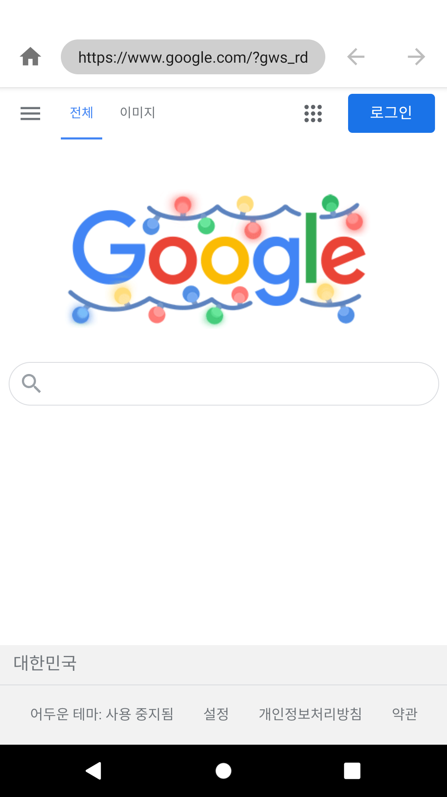
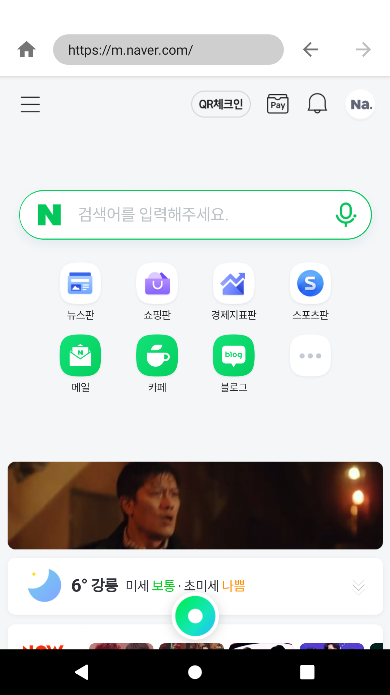

# Android Clone Coding Project #8 심플 웹 브라우저
간단한 웹 브라우저 구현
 
뒤로 가기 앞으로 가기 기능
 
홈 기능
 

# 결과화면
|Screenshot1|Screenshot2|
|---|---|
|||

# 배운 내용 정리
- WebView
  - WebViewClient
  - WebChromeClient
- SwipeRefreshLayout
- ContentLoadingProgressBar
